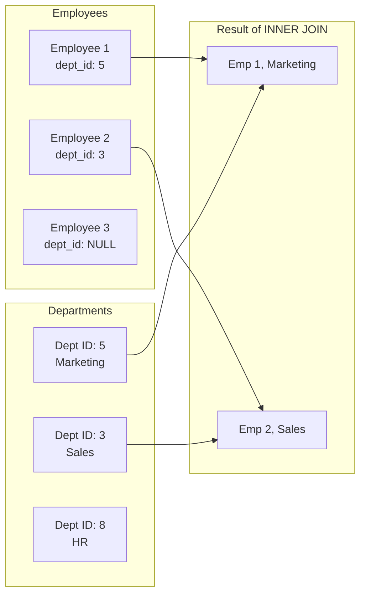
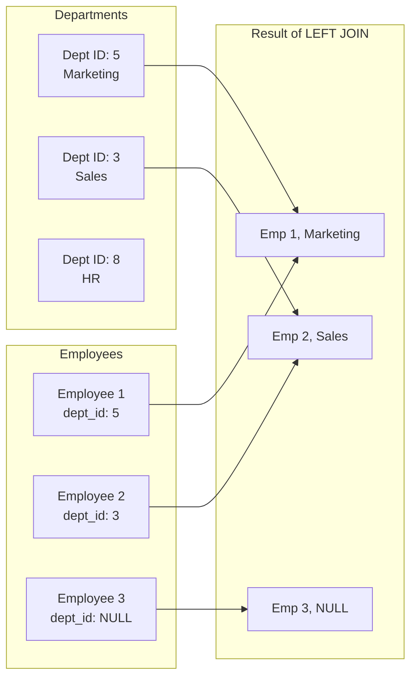

## 1. What is a SQL JOIN?

A SQL `JOIN` clause is used to **combine rows from two or more tables** based on a related column between them. It allows you to create a new, temporary result set that incorporates columns from all joined tables.

**Core Concept:** A JOIN horizontally combines data from multiple tables into a single, wider result set.

### Basic Syntax:

```sql
SELECT column_list
FROM table_1
[JOIN_TYPE] JOIN table_2
    ON table_1.column_name = table_2.column_name;
```

---

## 2. Why Use JOINs?

JOINs are the fundamental operation in relational databases, designed to eliminate data redundancy (normalization) and then efficiently reassemble data for querying.

1.  **Reassemble Normalized Data:** Databases are designed to avoid storing the same data multiple times (normalization). For example, you don't store the department name in every employee row; you store a `department_id`. JOINs are the primary tool for pulling this data back together.
2.  **Performance:** For combining table data, especially when you need columns from multiple tables in the final result, JOINs are almost always **more performant** than equivalent subqueries. They are optimized for set-based operations.
3.  **Clarity and Standardization:** The `JOIN...ON` syntax is a clear, standard, and readable way to express the relationship between tables. It explicitly states how the tables are linked.
4.  **Flexibility:** Different types of JOINs (`INNER`, `LEFT`, `RIGHT`, `FULL`) give you precise control over which rows should be included in or excluded from the result set.

---

## 3. When and How to Use JOINs?

The type of JOIN you use is determined by the question you need to answer.

### A. INNER JOIN

- **When to use:** When you only want rows where there is a **match in both tables**. This is the most common type of JOIN.
- **What it does:** It returns records that have matching values in both tables. Non-matching rows from both tables are discarded.

**Example:** Get a list of all employees who are assigned to a department, along with their department name.

```sql
SELECT e.first_name, e.last_name, d.department_name
FROM employees e
INNER JOIN departments d
    ON e.department_id = d.department_id;
```

**Visualization with Mermaid:**
This Venn diagram is the classic way to understand JOINs. The `INNER JOIN` is the intersection.



### B. LEFT (OUTER) JOIN

- **When to use:** When you want **all records from the left table (first table mentioned)**, and the matched records from the right table. If there is no match, the result set will contain `NULL` values from the right table.
- **What it does:** "Return me all employees, and if they have a department, give me that too."

**Example:** Get a list of ALL employees, and show their department name if they have one.

```sql
SELECT e.first_name, e.last_name, d.department_name
FROM employees e
LEFT JOIN departments d
    ON e.department_id = d.department_id;
```

**Visualization with Mermaid:**
The `LEFT JOIN` includes the entire left circle and the overlapping part of the right circle.



### C. Other JOIN Types

- **RIGHT (OUTER) JOIN:** The reverse of a `LEFT JOIN`. It returns all records from the right table and the matched records from the left table. Less commonly used because you can usually change the table order and use a `LEFT JOIN`.
- **FULL (OUTER) JOIN:** Returns all records when there is a match in either the left or right table. It's a combination of both `LEFT` and `RIGHT` joins. If there's no match, missing sides are filled with `NULL`.

---

## 4. JOINs vs. Subqueries

This is a key decision point. Here’s a direct comparison and when to choose which.

| Feature         | JOINs                                                                                      | Subqueries                                                                                                      |
| :-------------- | :----------------------------------------------------------------------------------------- | :-------------------------------------------------------------------------------------------------------------- |
| **Primary Use** | **Combining** columns from multiple tables into a new result set.                          | **Filtering** or **providing a value** based on the result of another query.                                    |
| **Result Set**  | **Horizontal** combination (more columns).                                                 | Often used for a **vertical** or **scalar** operation (e.g., filtering a list of rows, getting a single value). |
| **Performance** | **Generally faster** for combining data, especially on large datasets with proper indexes. | Can be **slower**, especially correlated subqueries that execute once per row.                                  |
| **Readability** | Very clear for expressing **relationships between tables**.                                | Very clear for expressing **step-by-step logic** or **conditional filters**.                                    |
| **Must Use**    | When you need **columns from multiple tables** in your final select list.                  | When you need to **use an aggregate function (MAX, AVG) in a filter** (`WHERE salary > AVG(salary)`).           |

### When to Choose Which:

- **Use a JOIN when:**

  > **"Show me details from multiple tables."**

  - You need to display columns from Table A and Table B.
  - _Example: "Get employee names and their department names."_

- **Use a Subquery when:**
  > **"Filter this table based on a complex condition from another table."**
  - You are filtering in the `WHERE` clause using a condition that requires a separate `SELECT` (especially with aggregates).
  - _Example: "Find all employees who earn more than the average salary."_
  - _Example: "Find products that have never been ordered." (Using `NOT IN` or `NOT EXISTS`)_

### Interchangeable Example (The Interview Question):

**Question: "Find all employees who work in the 'Sales' department."**

**Solution 1: Using a JOIN (Usually Preferred)**

```sql
SELECT e.employee_id, e.first_name, e.last_name
FROM employees e
INNER JOIN departments d ON e.department_id = d.department_id
WHERE d.department_name = 'Sales';
```

**Solution 2: Using a Subquery**

```sql
SELECT employee_id, first_name, last_name
FROM employees
WHERE department_id IN (
    SELECT department_id
    FROM departments
    WHERE department_name = 'Sales'
);
```

**Which is better?** For this specific query, the `JOIN` is often preferred because it's more direct. However, a modern SQL optimizer will likely execute both plans in the same efficient way. Your choice might depend on readability or personal preference. The key is to understand that both are valid and to be able to explain the difference.

---

## 5. Advanced JOIN Concepts

1.  **Joining More Than Two Tables:**

    ```sql
    SELECT e.first_name, e.last_name, d.department_name, l.city
    FROM employees e
    INNER JOIN departments d ON e.department_id = d.department_id
    INNER JOIN locations l ON d.location_id = l.location_id; -- Joining to a third table
    ```

2.  **Self-JOIN:** Joining a table to itself. Crucial for hierarchical data or comparing rows within the same table.
    **Example: "Find each employee's manager's name."**

    ```sql
    SELECT emp.first_name AS Employee,
           mgr.first_name AS Manager
    FROM employees emp
    LEFT JOIN employees mgr ON emp.manager_id = mgr.employee_id;
    ```

3.  **Non-Equi JOIN:** Joining on a condition that isn't an equals sign (`=`).
    **Example: "Create a report of all products and their prices, paired with products that are within a $10 price range."**
    ```sql
    SELECT A.product_name, A.price, B.product_name, B.price
    FROM products A
    JOIN products B ON A.price BETWEEN B.price - 10 AND B.price + 10
    WHERE A.product_id != B.product_id;
    ```
