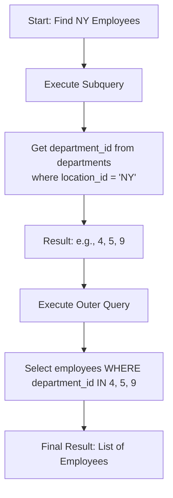
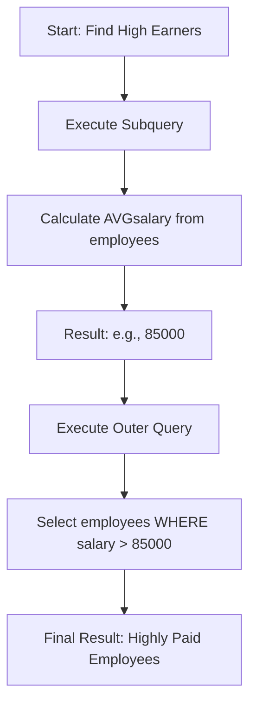

## 1. What is a Subquery?

A subquery (also known as an inner query or nested query) is a SQL query nested inside another query (the outer query). It's a powerful tool for performing operations in multiple steps.

**Core Concept:** The result of the inner query is used as a *value*, a *set of values*, or a *table* for the outer query to operate upon.

### Basic Syntax:
```sql
SELECT column_1, column_2
FROM table_1
WHERE column_1 OPERATOR (
    SELECT column_1 
    FROM table_2 
    WHERE condition
);
```

---

## 2. Why Use Subqueries? (The "Why")

Subqueries are essential for solving complex problems that are difficult or impossible to solve with a single, flat `SELECT` statement.

1.  **Break Down Complex Problems:** They allow you to solve a problem step-by-step. You can write a query to find an intermediate result (e.g., "find the average salary") and then use that result in another query (e.g., "find employees who earn more than the average").
2.  **Readability and Structure:** For some problems, a well-written subquery can be more intuitive and easier to understand than a complex join with multiple conditions.
3.  **Alternative to Joins:** They can often be used as an alternative to `JOINs`, especially for existence checks (`IN`, `EXISTS`) or for comparing aggregated values.
4.  **Perform Operations Unachievable with Joins:** The most classic example is comparing a value to an aggregate (like the average) in the `WHERE` clause. You cannot use a plain aggregate function in a `WHERE` clause; a subquery is the standard solution.

---

## 3. When to Use Subqueries? (The "When" & "How")

Subqueries can be used in several parts of the main query. Their placement defines their purpose and behavior.

### A. Subqueries in the `WHERE` Clause

This is the most common use case. They are used to filter results based on the output of the inner query.

#### i. With the `IN` Operator
Use when the subquery returns **multiple rows (a list of values)**.

**Example:** Find all employees who work in departments located in 'New York'.
```sql
SELECT first_name, last_name
FROM employees
WHERE department_id IN (
    SELECT department_id
    FROM departments
    WHERE location_id = 'NY' -- Assuming 'NY' is the code for New York
);
```

**Visualization with Mermaid:**
This diagram shows the two-step process: first get the list of IDs, then use that list to filter the main table.



#### ii. With Comparison Operators (`=`, `>`, `<`, `>=`, `<=`, `<>`)
Use when the subquery is guaranteed to return a **single value (a scalar)**.

**Example:** Find all employees whose salary is greater than the company's average salary.
```sql
SELECT first_name, last_name, salary
FROM employees
WHERE salary > (
    SELECT AVG(salary)
    FROM employees
);
```

**Visualization with Mermaid:**


#### iii. With the `EXISTS` Operator
Use for **existence checks**. The subquery doesn't return data; it returns `TRUE` if at least one row is found, and `FALSE` otherwise. It's often very efficient because it stops processing after the first match.

**Example:** Find all departments that have at least one employee.
```sql
SELECT department_name
FROM departments d
WHERE EXISTS (
    SELECT 1
    FROM employees e
    WHERE e.department_id = d.department_id
);
```
*Note: `SELECT 1` is a common practice with `EXISTS` since the actual data selected is irrelevant; only the existence of a row matters.*

---

### B. Subqueries in the `FROM` Clause (Derived Tables / Inline Views)
Here, the subquery acts as a **temporary table** that the outer query uses. You **must** give this subquery an alias.

**Example:** Find the average salary per department, but only show those averages that are greater than the company's overall average.
```sql
SELECT dept_avg.department_name, dept_avg.avg_salary
FROM (
    -- This subquery creates a temporary table with department averages
    SELECT d.department_name, AVG(e.salary) as avg_salary
    FROM departments d
    JOIN employees e ON d.department_id = e.department_id
    GROUP BY d.department_name
) AS dept_avg -- This alias is mandatory!
WHERE dept_avg.avg_salary > (
    SELECT AVG(salary) FROM employees
);
```

---

### C. Subqueries in the `SELECT` Clause (Scalar Subqueries)
Use a subquery to return a **single value** for each row processed by the main query. It runs for *every row* in the outer query, so it can be slow on large datasets.

**Example:** Show each employee's salary and how much it differs from the average salary.
```sql
SELECT
    first_name,
    last_name,
    salary,
    salary - (SELECT AVG(salary) FROM employees) AS diff_from_avg
FROM employees;
```

---

## 4. Types of Subqueries: Correlated vs. Non-Correlated

This is a **very common interview question**.

| Feature | Non-Correlated Subquery | Correlated Subquery |
| :--- | :--- | :--- |
| **Definition** | Inner query can run **independently** of the outer query. | Inner query **depends** on the outer query for its values. It's executed once for each row processed by the outer query. |
| **Execution** | Executes **once**. Result is passed to the outer query. | Executes **repeatedly**, once for each candidate row of the outer query. |
| **Performance** | Generally **faster**. | Generally **slower** due to repeated execution. Needs careful indexing. |
| **Example** | `WHERE salary > (SELECT AVG(salary) FROM employees)` | `WHERE EXISTS (SELECT 1 FROM jobs j WHERE e.job_id = j.job_id)` |

**Correlated Example in Detail:** The `EXISTS` example above is a perfect correlated subquery. Notice how the inner query (`e.department_id = d.department_id`) references a column (`d.department_id`) from the outer query.

---

## 5. Subqueries vs. JOINs: Which to Choose?

Another **very common interview question**. There's no absolute rule; it depends on the scenario.

*   **Use a SUBQUERY when:**
    *   You need to check for existence (`EXISTS`).
    *   You are comparing a value to an aggregated result (`WHERE salary > AVG(salary)`).
    *   The logic is more intuitive and readable as a step-by-step process.
*   **Use a JOIN when:**
    *   You need to **return columns from multiple tables** in your final result set.
    *   Performance is critical and the join can be optimized with indexes better than the subquery can be.

**Often, they are interchangeable:**
```sql
-- Using a Subquery with IN
SELECT name FROM products
WHERE category_id IN (SELECT id FROM categories WHERE name = 'Beverages');

-- Using a JOIN
SELECT p.name
FROM products p
JOIN categories c ON p.category_id = c.id
WHERE c.name = 'Beverages';
```
In modern databases, the query optimizer often executes these two statements in the same way. The `JOIN` syntax is generally preferred for simple lookups like this because it's more explicit.

---

## Interview Cheat Sheet & Common Questions

1.  **"What is a subquery?"** Define it and give a simple example.
2.  **"What is the difference between a correlated and non-correlated subquery?"** Use the table above. Mention execution order and performance.
3.  **"Can you use a subquery in the `SELECT` clause? Give an example."** Yes, for scalar values.
4.  **"How would you find the second highest salary?"** A classic!
    ```sql
    SELECT MAX(salary)
    FROM employees
    WHERE salary < (SELECT MAX(salary) FROM employees);
    ```
5.  **"When would you use `EXISTS` instead of `IN`?"** `EXISTS` is often better for correlated subqueries and when checking for existence, as it can short-circuit (stop after the first match). `IN` can be slower if the subquery returns a very large list.
6.  **"Can a subquery return more than one column?"** Yes, but only when used in the `FROM` clause (as a derived table). In the `WHERE` clause, it typically returns only one column to be used with operators like `IN` or `=`.

