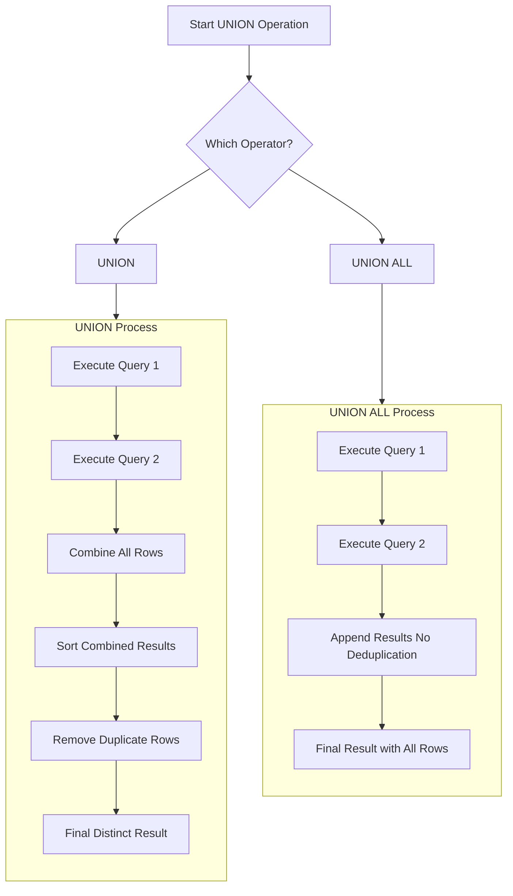

The `UNION` operation is a fundamental part of SQL that serves a very different purpose than `JOINs` or subqueries. Let's break it down comprehensively to grasp the concept in depth.

By understanding `UNION`, you add a powerful tool for data aggregation and reporting to your SQL toolkit, allowing you to solve a different class of problems than `JOINs` or subqueries address.

---

## 1. What is a SQL UNION?

A SQL `UNION` operator is used to **combine the result sets of two or more `SELECT` statements** into a single result set. It stacks the results vertically.

**Core Concept:** `UNION` is used for concatenating rows, not for combining columns like a `JOIN`.

### Basic Syntax:
```sql
SELECT column1, column2 FROM table1
UNION
SELECT column1, column2 FROM table2;
```

---

## 2. Why Use UNION? (The "Why")

`UNION` is designed for specific scenarios where data needs to be aggregated from different sources or queries into a single, unified list.

1.  **Combine Similar Data from Different Tables:** Useful when you have the same category of data split across multiple tables (e.g., a `2023_sales` table and a `2024_sales` table).
2.  **Merge Data from Different Perspectives:** To create a combined list from different queries against the same table (e.g., getting a list of both the highest-paid and lowest-paid employees).
3.  **Data Normalization and Reporting:** Essential for creating comprehensive reports that need to pull together disparate but similar data sets.
4.  **Alternative to Full Outer Join (sometimes):** In databases that don't support `FULL OUTER JOIN` (like MySQL), `UNION` can be used to simulate one by combining a `LEFT JOIN` and a `RIGHT JOIN`.

---

## 3. When and How to Use UNION? (The "When" & "How")

The key to using `UNION` lies in understanding its strict rules.

### A. UNION vs. UNION ALL

This is the most important distinction and a **very common interview question**.

| Feature | UNION | UNION ALL |
| :--- | :--- | :--- |
| **Purpose** | Combines result sets and **removes duplicate rows**. | Combines result sets and **keeps all duplicate rows**. |
| **Performance** | **Slower** because it must sort and deduplicate the entire combined result set. | **Faster** because it simply appends the results without any checks. |
| **When to Use** | When you know there might be duplicates and you want a distinct list. | When you know there are no duplicates, or when duplicates are meaningful (e.g., counting items). |

**Example:** Get a distinct list of all cities where either employees or departments are located.
```sql
SELECT city FROM employees_locations
UNION
SELECT city FROM departments_locations
ORDER BY city; -- ORDER BY can only be used on the final result
```

**Example:** Get a combined list of all product names, including duplicates if they exist.
```sql
SELECT product_name FROM current_products
UNION ALL
SELECT product_name FROM discontinued_products;
```

### B. The Rules of UNION

For a `UNION` to work, each `SELECT` statement must adhere to two rules:
1.  **Same Number of Columns:** Each `SELECT` must have the same number of columns.
2.  **Compatible Data Types:** The corresponding columns in each `SELECT` must have compatible data types (e.g., `VARCHAR` to `TEXT`, `INT` to `BIGINT`). The column names do not need to be the same; the column names from the *first* `SELECT` statement will be used in the final result.

**Visualization with Mermaid:**
This diagram shows how `UNION` and `UNION ALL` process the data differently.



**Example of the Rules:** This query will work even though the column names are different.
```sql
-- Gets a combined list of people's names and company names
SELECT first_name AS 'Name' FROM employees  -- Column is VARCHAR
UNION
SELECT department_name FROM departments     -- Column is also VARCHAR
UNION
SELECT 'Fixed String';                      -- Compatible with VARCHAR
```

---

## 4. UNION vs. JOIN: The Fundamental Difference

This is a crucial interview topic. `UNION` and `JOIN` solve completely different problems.

| Operation | Combines Data... | Visual Analogy | Purpose |
| :--- | :--- | :--- | :--- |
| **JOIN** | **Horizontally** (adds more columns) | **Venn Diagram** (overlap) | Combine related data from different tables based on a key. |
| **UNION** | **Vertically** (adds more rows) | **Stacking Lists** | Aggregate similar data from different sources into one column list. |

**Example Scenario:** You have an `employees` table and a `departments` table.

*   **A JOIN Question:**
    > "**Show me employees alongside their department name.**" (You need columns from both tables).
    ```sql
    SELECT e.first_name, d.department_name
    FROM employees e
    INNER JOIN departments d ON e.department_id = d.department_id;
    ```
    *Result: A wide table with columns from both tables.*

*   **A UNION Question:**
    > "**Get a single list of all names we have in the system, both employee names and department names.**"
    ```sql
    SELECT first_name AS 'Name' FROM employees
    UNION
    SELECT department_name FROM departments;
    ```
    *Result: A single column list with values from both tables stacked on top of each other.*

---

## 5. Practical Use Cases and Interview Questions

### Common Use Cases:
1.  **Combining Historical and Current Data:**
    ```sql
    SELECT sale_id, amount, '2023' AS year FROM sales_2023
    UNION ALL
    SELECT sale_id, amount, '2024' AS year FROM sales_2024;
    ```
2.  **Creating Summary Reports:**
    ```sql
    SELECT 'High Salary' AS category, COUNT(*) FROM employees WHERE salary > 100000
    UNION
    SELECT 'Medium Salary', COUNT(*) FROM employees WHERE salary BETWEEN 50000 AND 100000
    UNION
    SELECT 'Low Salary', COUNT(*) FROM employees WHERE salary < 50000;
    ```
3.  **Simulating a FULL OUTER JOIN in MySQL:**
    ```sql
    -- Find all employees and departments, showing matches and unassigned/missing ones
    SELECT e.name, d.department_name
    FROM employees e
    LEFT JOIN departments d ON e.dept_id = d.dept_id
    UNION
    SELECT e.name, d.department_name
    FROM employees e
    RIGHT JOIN departments d ON e.dept_id = d.dept_id;
    ```

### Classic Interview Questions:

1.  **"What is the difference between `UNION` and `UNION ALL`?"**
    > **Answer:** `UNION` removes duplicate records from the combined result set, while `UNION ALL` includes all records, including duplicates. `UNION ALL` is faster because it doesn't require the database to process duplicates.

2.  **"What are the rules for using a `UNION` operator?"**
    > **Answer:** Each `SELECT` statement within the `UNION` must have the same number of columns. The corresponding columns must also have compatible data types.

3.  **"When would you use a `UNION` instead of a `JOIN`?"**
    > **Answer:** I would use a `JOIN` when I need to combine columns from different tables based on a relationship to create a wider result. I would use a `UNION` when I need to combine rows from different queries or tables into a single, unified list, essentially making the result set longer.

4.  **"How would you combine data from two tables with different structures?"**
    > **Answer:** I would use `UNION` by selecting the same number of columns and using `NULL` placeholders or constant values for missing columns to make the structures match.
    ```sql
    SELECT product_id, product_name, NULL AS supplier_name FROM products
    UNION
    SELECT supplier_id, NULL, supplier_name FROM suppliers;
    ```

